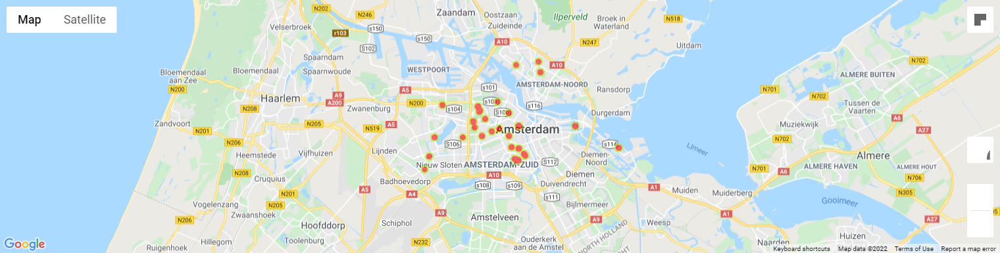

# ams-real-estate
Predict house prices in Amsterdam based on data scraped from Pararius (compliant to ToS) and Google Places.

# Data
pararius-requests.py: Scrape Amsterdam house listings from Pararius

clean.py: Clean data to get price, postcode, size, number of bedrooms, and year constructed/last renovated

distance.py: Convert the postcode into coordinates, then calculate the distance from each houses to the Centraal Station (distance1) and Zuid Station (distance2)

google-maps-rating.py: For each house, get 20 nearest restaurants/bars, and 5 most recent ratings, then calculate the average rating (nearby rating)

# EDA
gmaps.py: Draw a heatmap based on price

graphs.py: Draw scatter plots

correlation.py: Draw correlation matrix

# Random forest
random-forest.py: Initial model

parameter-tuning.py: Find the best parameters

random-forest-tuned.py: Model with the best parameters

prediction.py: Try predicting the price

decision-tree.py: Visualize decision trees

feature-importance-plot.py: Compare importance of features

# 