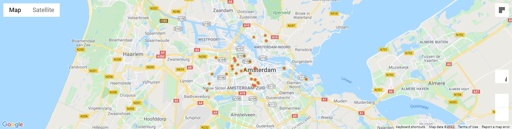

# ams-real-estate
Predict house price in Amsterdam based on data scraped from Pararius (compliant to ToS) and Google Places.

# Data
pararius-requests.py: Scrape Amsterdam house listings from Pararius (870 listings in total)

clean.py: Clean data to get price, postcode, size, number of bedrooms, and year constructed/last renovated

distance.py: Convert postcode into coordinates, then calculate the distance from each house to Centraal Station (distance1) and Zuid Station (distance2)

google-maps-rating.py: For each house, get 20 nearest restaurants/bars, and 5 most recent ratings, then calculate the average rating (nearby rating)

# EDA
gmaps.py: Draw a heatmap based on price

graphs.py: Draw scatter plots

correlation.py: Draw correlation matrix

# Random forest
random-forest.py: Initial model

parameter-tuning.py: Find the best parameters

random-forest-tuned.py: Model with the best parameters

prediction.py: Try predicting the price

decision-tree.py: Visualize decision trees

feature-importance-plot.py: Compare importance of features

# Remarks
- Lack of data results in low accuracy
- Multiple linear regression could perform better for cases where distance to multiple hotspots is included

# Further research
- Rent price instead of house price (more data available)
- Other cities of the Netherlands
- Factor in more parameters (altitude, condition, etc.)
- Try to update the model in real time (AWS)
